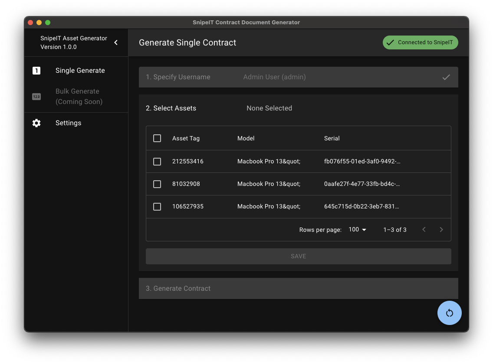

# SnipeIT Contract Generator
A electron based application that generates IT agreement documents using data from the SnipeIT API.



## Features
* Select a SnipeIT user to generate a contract for.
* Select assets to include in the contract.
* Generate a contract in PDF format.
* Partial customization of the contract template
  * You can only use the markers that are already in the template.
  * The following fields are available at this time:
    * {{pin}} - The user's pin.
    * {{full_name}} - The user's full name.
    * {{email}} - The user's email address.
    * {{table}} - The table of assets. Only the asset tag, description/name and serial number are included.
  * A sample template is included in the 'sample' directory in this repository.

## Planned Features
* Allow the user to specify custom markers in the contract template.
* Bulk contract generation.

## Download
* Prebuilt binaries are available for Windows, MacOS and Linux on the releases page.
* The MacOS app is signed and notarized.
* On first start, you will need to configure your SnipeIT API URL, API key and template location. This can be done under the 'Settings' tab.

## Building
```bash
git clone https://github.com/mclarence/SnipeIT-Contract-Generator
cd snipeit-contract-generator
# Install dependencies
npm install # or yarn install
# Run the app
npm start # or yarn start
# Package the app
npm run package # or yarn package
```

## Contributing
Contributions are welcome. Please open an issue or submit a pull request.

## License
MIT